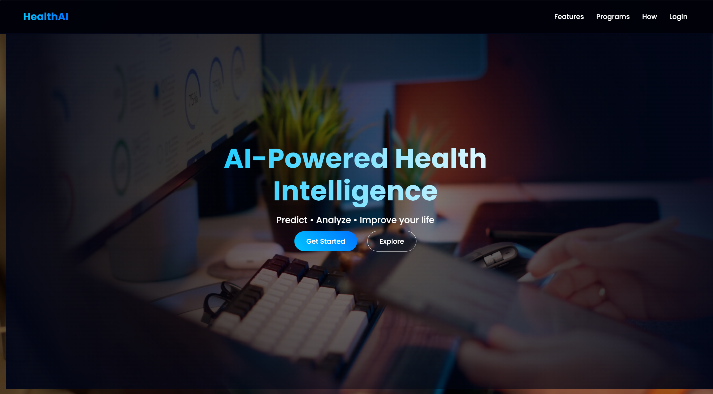
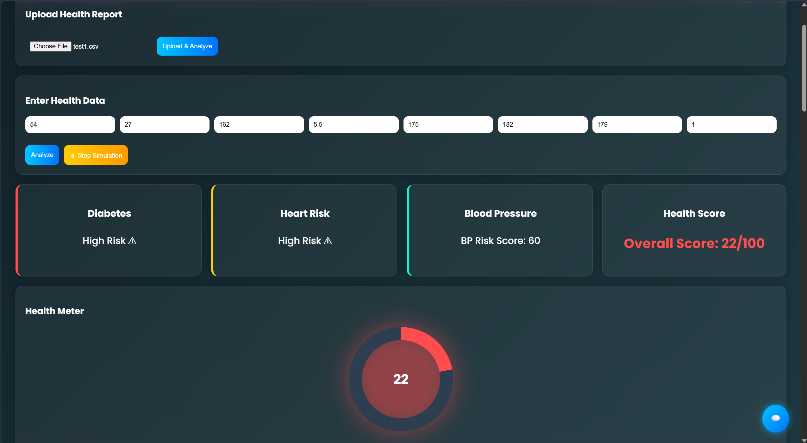
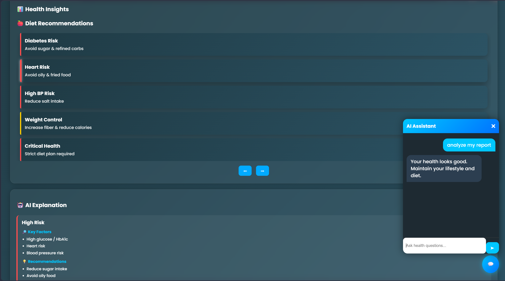
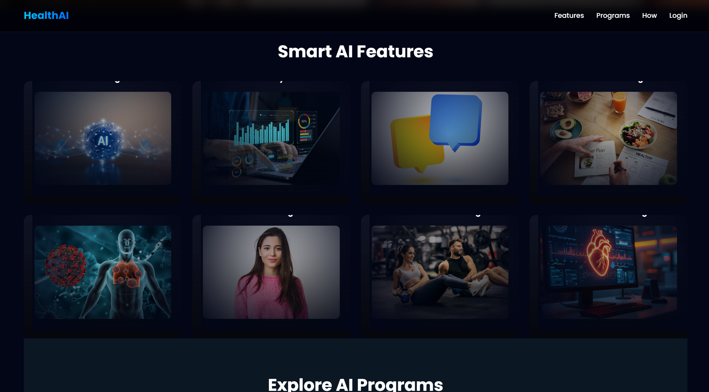
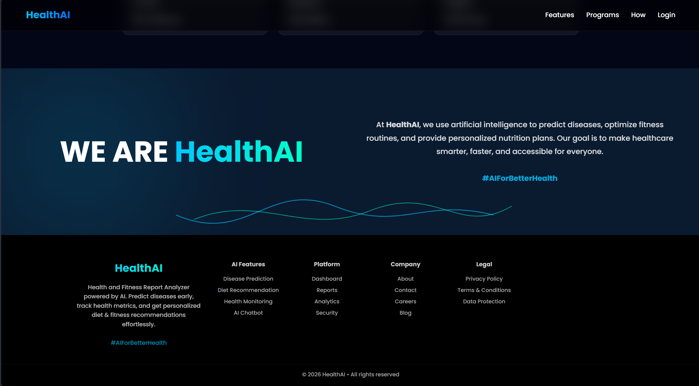
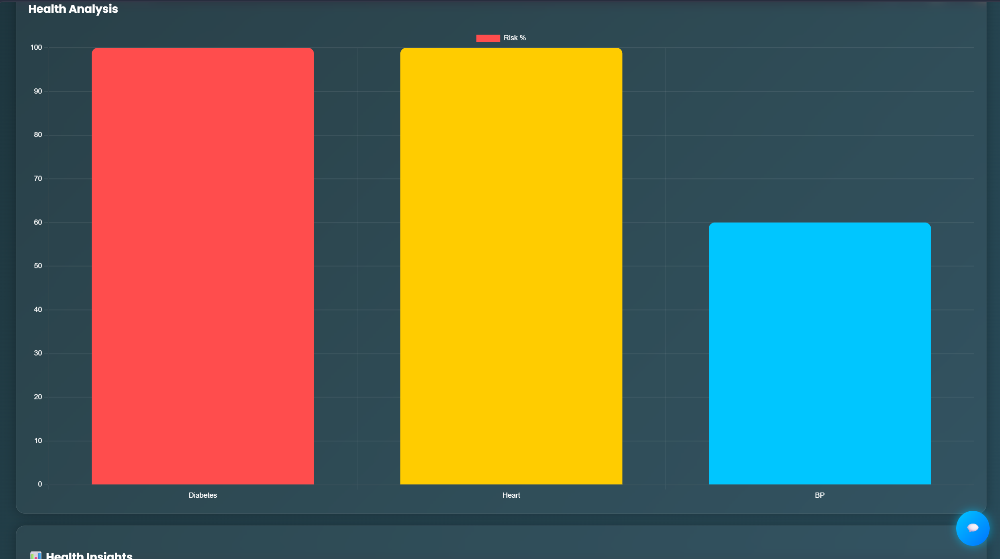

# ✅ 📄 README.md (FULL)

```markdown
# 🏥 HealthAI & Report Analyzer

An intelligent healthcare web application that analyzes patient data, predicts health risks,
and generates professional medical reports with AI-driven insights.

## 🚀 Features

- 📊 Health Risk Prediction (Diabetes, Heart, BP)
- 📈 Interactive Dashboard with Charts & Visualizations
- 🤖 AI Medical Explanation (pointwise insights)
- 🧪 Simulation Mode (test different health conditions)
- 📄 Multi-page PDF Report Generation
- 🏥 Hospital-style Report (with doctor signature section)
- 🔗 QR Code for report access
- 📥 One-click Download Report

## 🧠 AI Explanation Includes

- Risk Level (High / Moderate / Low)
- Key Factors
- Personalized Recommendations

## 🛠️ Tech Stack

Frontend:
- HTML
- CSS
- JavaScript

Backend:
- Python (Flask)

Libraries:
- Chart.js (visualization)
- ReportLab (PDF generation)
- Matplotlib (charts)

## 📂 Project Structure

Health-AI-App/
│
├── static/
│   ├── css/
│   ├── js/
│   └── logo.png
│
├── templates/
│   └── dashboard.html
│
├── uploads/
│   └── (generated reports)
│
├── app.py
├── database.py
├── requirements.txt

````

## ⚙️ Installation

```bash
git clone https://github.com/rajput620/Health-AI-and-Report-Analyzer.git
cd Health-AI-and-Report-Analyzer
pip install -r requirements.txt
python app.py
````

Open in browser:

```
http://127.0.0.1:5000
```

---

## 📸 Screenshots

* Dashboard UI
* Health Insights
* AI Explanation
* PDF Report












## 📄 Report Features

* Patient Information
* Risk Analysis
* Graphical Charts
* AI Explanation (bullet format)
* Doctor Signature Section
* QR Code for access

---

## 🔐 Notes

* This is not a medical diagnosis tool.
* Consult a certified doctor for real medical advice.

---

## 👨‍💻 Author

Gaurav Kumar, Aaryan Raj, Shivani Singh, Anushka Kumari 

---

## ⭐ Future Improvements

* Doctor login system
* Real-time patient monitoring
* Mobile app integration
* AI model enhancement

---

